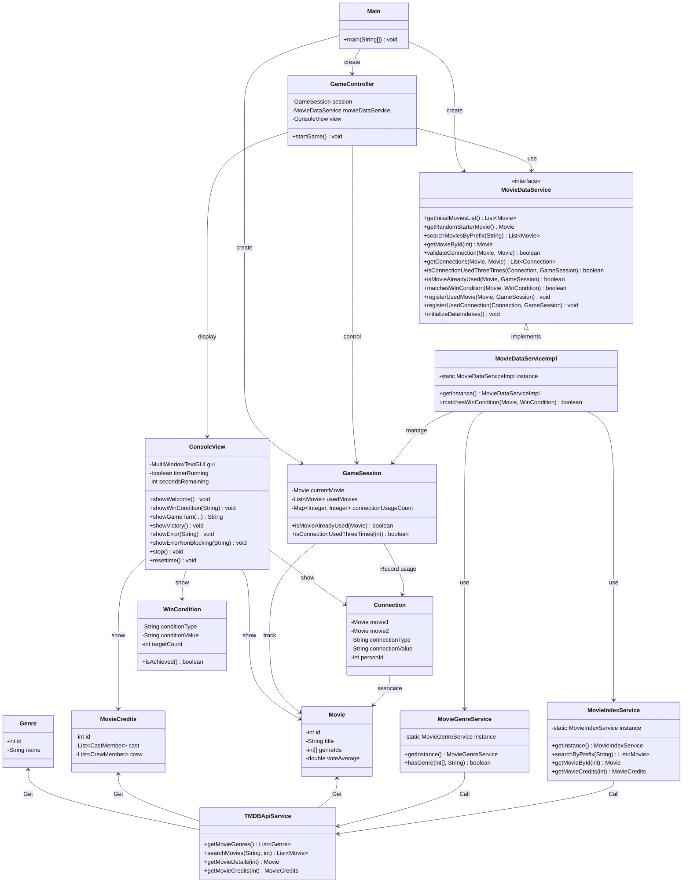

# Movie Battle Game System Project Documentation


HongKai Zhang, Feng Jiang, YuKun Gao

## Additional Package:
### Lombok `@Slf4j` Annotation

The `@Slf4j` annotation is part of the **Lombok** library and is used to automatically generate a `Logger` instance (specifically using **SLF4J** – Simple Logging Facade for Java) in your class.

Instead of writing:

```java
import org.slf4j.Logger;
import org.slf4j.LoggerFactory;

public class MyClass {
    private static final Logger log = LoggerFactory.getLogger(MyClass.class);
}
```
You can simply annotate your class with @Slf4j:
```java
import lombok.extern.slf4j.Slf4j;

@Slf4j
public class MyClass {
    public void run() {
        log.info("This is an info message.");
        log.error("This is an error message.");
    }
}
```

### Installation

To use `@Slf4j`, you need two things:

---

#### 1. Add Lombok and SLF4J to your project

##### We already took care this park (just in case) **Maven**:

```xml
<dependencies>
    <!-- Lombok -->
    <dependency>
        <groupId>org.projectlombok</groupId>
        <artifactId>lombok</artifactId>
        <version>1.18.30</version>
        <scope>provided</scope>
    </dependency>

    <!-- SLF4J API -->
    <dependency>
        <groupId>org.slf4j</groupId>
        <artifactId>slf4j-api</artifactId>
        <version>2.0.9</version>
    </dependency>

    <!-- SLF4J Implementation (e.g., logback-classic) -->
    <dependency>
        <groupId>ch.qos.logback</groupId>
        <artifactId>logback-classic</artifactId>
        <version>1.4.11</version>
    </dependency>
</dependencies>
```

#### 2. Enable annotation processing in your IDE

- **In IntelliJ IDEA**:  
  Go to `Preferences > Build, Execution, Deployment > Compiler > Annotation Processors`,  
  and check **"Enable annotation processing"**.

- **In Eclipse**:  
  Lombok should work automatically if you have the **Lombok plugin installed**.

## 1. MovieDataService's functions and methods

`MovieDataService is the core interface of the system, responsible for providing all movie data related functions required by the game. Specific functions include：

### Movie data acquisition
- `getInitialMoviesList()`: Get the initial movie list (Top 5000 popular movies)
- `getRandomStarterMovie()`: Get a random starting movie as the starting point of the game
- `searchMoviesByPrefix(String prefix)`: Search movies by prefix, support player input
- `getMovieById(int movieId)`: Get movie details by ID

### Movie connection validation
- `validateConnection(Movie previousMovie, Movie currentMovie)`: Verify if there is a valid connection between two movies
- `getConnections(Movie previousMovie, Movie currentMovie)`: Get all connections between two movies (common actors, directors, writers)

### Game rules management
- `isConnectionUsedThreeTimes(Connection connection, GameSession session)`: Check if the connection has been used three times
- `isMovieAlreadyUsed(Movie movie, GameSession session)`: Check if the movie has been used in the game
- `matchesWinCondition(Movie movie, WinCondition condition)`: Check if the movie meets the victory conditions (type, actor, director, screenwriter)

### Game status update
- `registerUsedMovie(Movie movie, GameSession session)`: Register the used movie
- `registerUsedConnection(Connection connection, GameSession session)`: Register the used connection

### System initialization
- `initializeDataIndexes()`: Initialize data indexes to prepare for fast query

## 2. Relationships and calling methods of each class

### Core service classes and their relationships

1. **MovieDataServiceImpl**
   - Implements the `MovieDataService` interface, which is the main business logic implementation of the system
   - Uses the singleton mode and obtains the instance through the `getInstance()` method
   - Relies on `MovieIndexService` for movie data retrieval and caching
   - Relies on `MovieGenreService` for movie type matching
   - Calls `TMDBMovieCacheService` to obtain the initial movie list

   ```java
   // Get service instance
   MovieDataService movieService = MovieDataServiceImpl.getInstance();

   // Search movies
   List<Movie> results = movieService.searchMoviesByPrefix("interstellar");

   // Check movie connection
   boolean isValid = movieService.validateConnection(movie1, movie2);
   ```

2. **MovieIndexService**
   - Responsible for building and maintaining multiple indexes of movies, providing fast query function
   - Manage movie title prefix index, ID index, actor index and director index
   - Cache movie details and cast information to reduce API calls
   - Call `TMDBApiService` to obtain uncached movie data

   ```java
   // Indirect use through MovieDataService
   Movie movie = movieService.getMovieById(123);

   // Can also be used directly (not recommended)
   MovieIndexService indexService = MovieIndexService.getInstance();
   List<Movie> actorMovies = indexService.getMoviesByActor(actorId);
   ```

3. **MovieGenreService**
   - Responsible for managing the mapping relationship of movie genres
   - Provides bidirectional mapping from genre ID to name and name to ID
   - Calls `TMDBApiService` to obtain a list of movie genres
   - Provides `hasGenre` method to determine whether a movie belongs to a specified genre

   ```java
   // Indirect use through MovieDataService (in matchesWinCondition method)
   boolean matches = movieService.matchesWinCondition(movie, genreCondition);

   // Can also be used directly (not recommended)）
   MovieGenreService genreService = MovieGenreService.getInstance();
   boolean hasAction = genreService.hasGenre(movie.getGenreIds(), "action");
   ```

4. **TMDBApiService**
   - Encapsulates the original request of TMDB API
   - Provides methods such as movie search, getting movie details, getting cast and crew, and getting type list
   - Called by other service classes, rarely used directly

5. **TMDBMovieCacheService**
   - Caches the popular movie list returned by TMDB API
   - Provides a method to get a specified number of popular movies
   - Reduce repeated API calls and improve performance

### Model classes and their usage

1. **Movie**
   - Represents TMDB movie entities, including information such as ID, title, genre ID, etc.
   - Is the core data model of the system and is widely used by various services

2. **MovieCredits**
   - Represents the cast and crew information of a movie, including a list of actors and crew members
   - Used to verify movie connections and victory conditions
3. **Genre**
   - Represents TMDB movie genres, including ID and name
   - Used for movie genre matching and victory condition verification

4. **Connection**
   - Represents the common relationship between two movies (actors, directors, etc.)
   - Used to record and verify movie connections in the game

5. **GameSession**
   - Represents a game session
   - Manages used movies and connections, as well as the current game status

6. **WinCondition**
   - Indicates the game winning condition
   - Contains the condition type, value and target number

## 3. View and Control Classes
### ConsoleView

The `ConsoleView` class provides the terminal-based user interface using the Lanterna library. It interacts with the player to display game information, prompt for input, handle countdown timers, and render live movie suggestions.

#### Core methods:
- `showWelcome()`: Display welcome message at the start of the game
- `showWinCondition(String)`: Display each player’s win condition
- `showGameTurn(...)`: Display the current round with movie history, movie details, suggestions, and input field
- `promptMoviePrefixWithLiveSuggestions(...)`: Provide real-time suggestions as the player types
- `showVictory()`: Display the victory screen when the win condition is achieved
- `showError(String)`: Show blocking error message window
- `showErrorNonBlocking(String)`: Show error in a separate thread without blocking UI
- `resettime()`: Reset the internal countdown timer to 30 seconds
- `stop()`: Cleanly shut down the Lanterna screen and GUI

```java
// Example usage inside the controller
view.showWelcome();
String inputTitle = view.showGameTurn(round, playerName, history, movie, condition, movieDataService, onTimeout, timerLabel, true);
view.showVictory();
```


### GameController

The `GameController` class manages the main game loop and orchestrates interactions between the game state (`GameSession`), the movie service (`MovieDataService`), and the user interface (`ConsoleView`).

#### Responsibilities:
- Initialize win conditions randomly at game start
- Display game progress and handle user input
- Validate selected movies and movie connections
- Track player progress toward their win condition
- Handle timer expiration and player switching
- End the game when a player meets their win condition

```java
// Example controller instantiation and launch
GameController controller = new GameController(session, movieDataService);
controller.startGame();
```


### Main

The `Main` class serves as the program’s entry point. It sets up the core dependencies and starts the game.

#### Responsibilities:
- Instantiate `MovieDataService` via singleton
- Select a starter movie (randomly chosen from top 5000 list)
- Initialize a new `GameSession` with placeholder win conditions (to be overridden)
- Instantiate and launch `GameController`

```java
public static void main(String[] args) {
    MovieDataService movieDataService = MovieDataServiceImpl.getInstance();
    Movie startMovie = movieDataService.getRandomStarterMovie();

    if (startMovie == null) {
        throw new RuntimeException("No starter movie available.");
    }

    GameSession session = new GameSession("session-001", startMovie, null, null, "Player1", "Player2");
    GameController controller = new GameController(session, movieDataService);
    controller.startGame();
}

```

## 4. System architecture UML diagram


